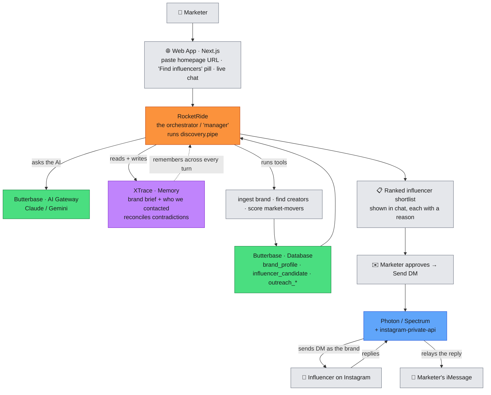

# How the 4 sponsor services work together

> Open this file on **github.com** from your phone — GitHub renders the diagram below automatically.

This is the journey of one request — a marketer pastes their brand's homepage URL and ends up
with a real influencer DM sent and the reply on their phone. Each box is colour-coded by which
sponsor service does the work.

## What each service does, in one line

| Service | Colour | Role in the product | Status in our code |
|---|---|---|---|
| **RocketRide** | 🟠 orange | The **manager** of the "find influencers" flow — decides which step/tool/AI call happens next (`discovery.pipe`). | ✅ Real (drives discovery; has a plain-code fallback) |
| **Butterbase** | 🟢 green | The **backend**: the only database (brand + influencer + outreach tables) **and** the only path to the AI models. | ⚠️ Partial — DB ✅ & AI gateway ✅; auth ❌ & storage ❌ unused |
| **XTrace** | 🟣 purple | The **long-term memory** — learns the brand, records who we contacted, recalls it next time, fixes contradictions. | ✅ Real (wired on onboard / discover / outreach) |
| **Photon** | 🔵 blue | The **messaging** layer — sends the real Instagram DM and relays the influencer's reply to the marketer's iMessage. | ✅ Real (needs live credentials to transmit) |

## The story the diagram tells

1. The marketer pastes a homepage URL into the **web app** and taps **"Find influencers."**
2. **RocketRide** takes over as the manager: it talks to the **AI (Butterbase gateway)**, reads/writes
   **memory (XTrace)**, and runs tools that look up the brand and score creators.
3. Everything it learns is saved in the **Butterbase database**; the work streams live into the chat.
4. Out comes a **ranked shortlist** of influencers, each with a one-line reason.
5. The marketer approves → **Photon** sends the **Instagram DM** as the brand.
6. The influencer **replies on Instagram** → **Photon relays it to the marketer's iMessage.**
7. **XTrace** quietly remembers the brand and everyone contacted, so the next run is smarter.
